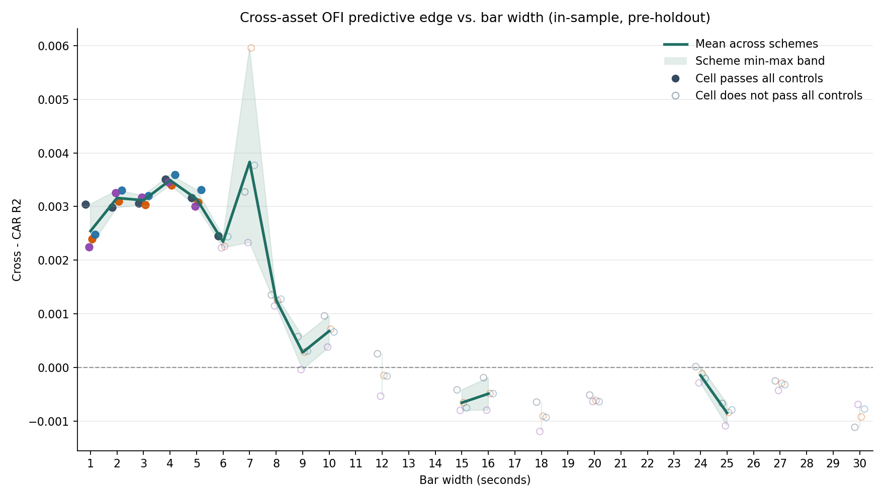

# Cross-Asset OFI in Crypto Markets

This repository tests whether cross-asset order-flow imbalance (OFI) predicts
short-horizon crypto returns across BTC, ETH, SOL and XRP order books.



## Current Finding

The strongest supported result is sub-minute cross-asset OFI predictability in
the OKX 2026-05-02 to 2026-06-26 sample. The effect is strongest at 1s-5s bars
and survives own-OFI, cross-return-history and day-shifted placebo controls
after conservative multiple-comparison correction.

This is a statistical microstructure result, not a finished trading strategy.
A trading claim would need a fresh holdout and explicit spread, latency,
queue-position, fee and market-impact modelling.

## What This Demonstrates

- High-frequency order-book reconstruction from raw OKX L2 snapshot/update data.
- OFI feature engineering across best-level, summed-depth, distance-weighted and
  PCA-integrated variants.
- Walk-forward forecasting with leakage controls, rolling train/test windows and
  purged horizons.
- Cross-asset model comparison against own-OFI, own-return, cross-return and
  day-shifted placebo baselines.
- Conservative statistical testing with Diebold-Mariano tests, Model Confidence
  Set diagnostics and multiple-comparison correction.
- A reproducible research workflow spanning scripts, a clean notebook, reports
  and generated output artifacts.

## Data

Raw data are not included in this repository. A reproducer must obtain the OKX
L2 snapshot/update `.data` files separately, then place them in
`data/historical/` before running the reconstruction or notebook workflow.

Expected raw-data pattern:

```text
data/historical/<ASSET>-USDT-L2orderbook-<depth>lv-YYYY-MM-DD.data
```

The expected sample is BTC-USDT, ETH-USDT, SOL-USDT and XRP-USDT from
2026-05-02 to 2026-06-26. Raw files are ignored by Git because they are large
local data artifacts. Reconstructed `.npz` caches are written to
`data/processed/`, also ignored by Git.

In `notebooks/main.ipynb`, run the setup and dependency cells first. After the
raw files are in `data/historical/`, run the third code cell, which inventories
the raw files and confirms that the notebook can see the local data.

Reconstruct books:

```powershell
python .\scripts\reconstruct.py --raw-dir data\historical --out-dir data\processed --levels 20 --jobs 1 --assets btc eth sol xrp --start 2026-05-02 --end 2026-06-26
```

## Environment

The dependency file uses minimum supported versions rather than a fully locked
environment:

```powershell
python -m venv .venv
.\.venv\Scripts\Activate.ps1
python -m pip install -r requirements.txt
```

For archival reproduction, install into a fresh environment and record the exact
resolved package set with `python -m pip freeze`.

## Reproduce

```powershell
python .\scripts\core_results.py
python .\src\tests.py
python .\scripts\analyze_tests_results.py
python .\scripts\confirm_candidates.py
python .\scripts\candidate_significance.py
python .\scripts\robustness_300s_ccz.py
python .\src\tests.py --spec subminute
python .\scripts\subminute_robustness.py
python .\scripts\subminute_decay.py
python .\scripts\plot_subminute_decay.py
python .\scripts\subminute_temporal_stability.py
```

For a notebook version of the same workflow, open `notebooks/main.ipynb`.

## Repository Layout

- `src/`: OFI construction, panels, predictive models, evaluation and tests.
- `scripts/`: reproducible project stages.
- `notebooks/main.ipynb`: executable reproduction notebook.
- `report/methodology.md`: rigorous step-by-step methodology.
- `report/report.md`: short outsider-facing summary.
- `output/core/`: focused 60s replication and construction diagnostics.
- `output/grid/`: broad search results and rankings.
- `output/confirmation/`: targeted confirmation and candidate significance.
- `output/robustness_300s/`: 300s placebo and robustness battery.
- `output/subminute/`: 1s/5s/10s sub-minute result.
- `output/subminute_decay/`: 1s-30s decay grid, curve and stability check.

## Main Artifacts

- `report/methodology.md`
- `report/report.md`
- `notebooks/main.ipynb`
- `output/subminute/report.md`
- `output/subminute_decay/report.md`
- `output/subminute_decay/curve.png`

## License

Code and documentation are released under the MIT License. Raw OKX data are not
included and are subject to the terms of the original data source.
