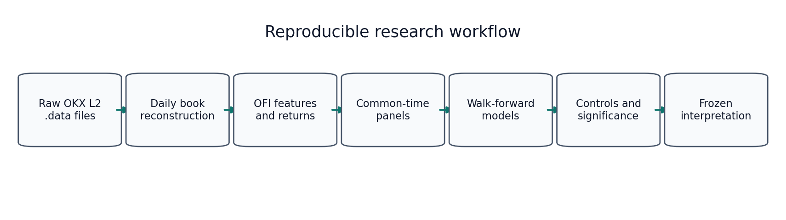
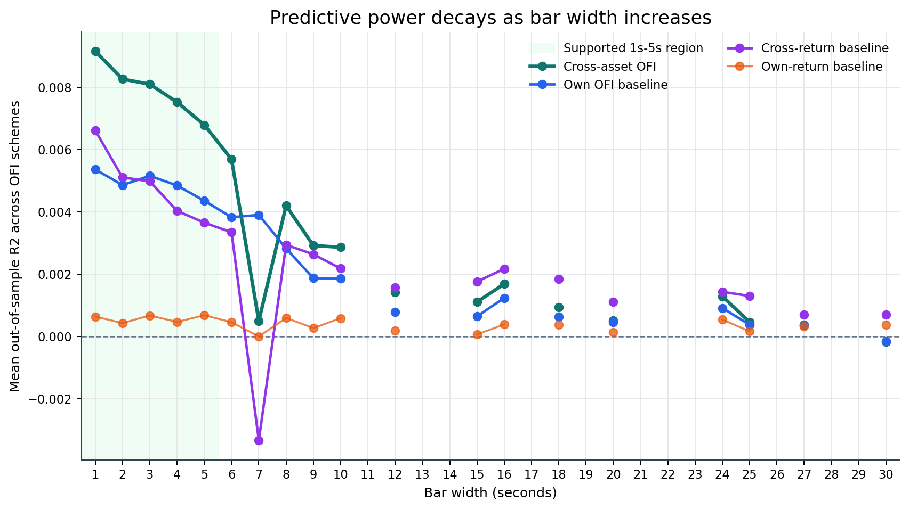
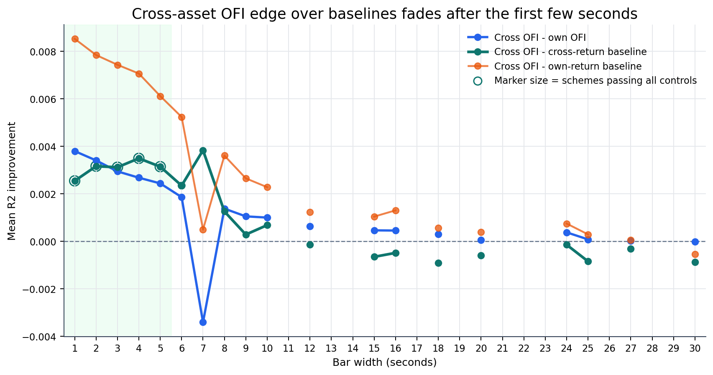
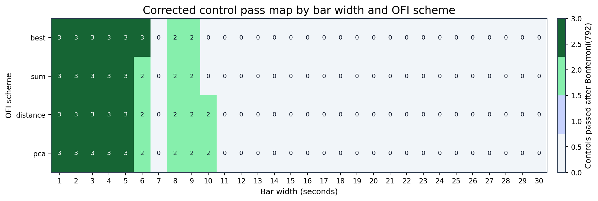
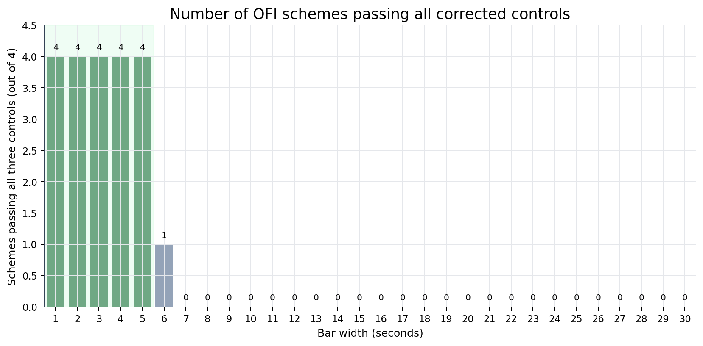

# Methodology

This file is the source methodology for the project. The short report in
`report/report.md` summarises this document, and `notebooks/main.ipynb` is the
executable reproduction path. The methodology is written as a third-party
research record: it describes the data, transformations, models, statistical
tests, output files and interpretation rules required to reproduce the result.

## 1. Research Objective

The project tests whether cross-asset order-flow imbalance (OFI) contains
short-horizon predictive information in crypto limit order books. The empirical
question is:

> Does buying or selling pressure in one liquid crypto asset help predict the
> near-future return of another asset after controlling for the target asset's
> own order flow and for price-history baselines?

The asset universe is BTC-USDT, ETH-USDT, SOL-USDT and XRP-USDT on OKX. The
sample covers 2026-05-02 to 2026-06-26. The work is inspired by the
Cont-Cucuringu-Zhang cross-impact framework, but the implementation is treated
as a fresh empirical test rather than as a guaranteed replication. Crypto market
microstructure differs from equities because it trades continuously, has no
exchange close, has different tick and fee regimes, and may transmit information
at sub-minute frequencies. The methodology therefore begins with the
paper-style 60-second setup, then adds a broader grid and stricter robustness
controls before accepting any positive claim.

The central interpretive rule is deliberately conservative. A cross-asset OFI
effect is treated as supported only if it beats:

1. the target asset's own OFI;
2. the target asset's own return history;
3. the other assets' return history;
4. a day-shifted cross-feature placebo;
5. the relevant multiple-comparison correction.

This rule prevents the project from labelling a generic cross-asset price
autocorrelation, a stale intraday pattern, or a grid-search artifact as
cross-asset order-flow predictability.

## 2. Reproducibility Contract

Raw data are not committed to GitHub. A reproducer must obtain the OKX L2
snapshot/update `.data` files separately and place them under
`data/historical/` before running the notebook or reconstruction scripts. The
expected raw-file pattern is:

```text
data/historical/<ASSET>-USDT-L2orderbook-<depth>lv-YYYY-MM-DD.data
```

where `<ASSET>` is one of `BTC`, `ETH`, `SOL` or `XRP`, and the date range is
2026-05-02 through 2026-06-26. The raw files and processed `.npz` caches are
ignored by Git because they are large local data artifacts.

The executable reproduction path is:

1. open `notebooks/main.ipynb`;
2. run the environment setup cell;
3. run the dependency-install cell;
4. download or copy the raw OKX `.data` files into `data/historical/`;
5. run the third code cell, which inventories the local data and fails with a
   clear error if no raw files are present;
6. run the reconstruction cell to build `data/processed/*.npz`;
7. run the analysis cells in order.

The notebook calls the same scripts used to create the committed `output/`
artifacts. Running it end to end is long because it reconstructs
the order books, executes discovery grids, performs significance testing and
generates the final decay and publication figures.



## 3. Notation

Let the asset set be:

```math
A = \{\mathrm{BTC}, \mathrm{ETH}, \mathrm{SOL}, \mathrm{XRP}\},
\qquad N = |A| = 4.
```

For asset $i \in A$, order-book snapshot/update time $n$, and depth level
$m \in \{1,\ldots,M\}$, define:

```math
P^{b}_{i,m,n}, Q^{b}_{i,m,n}
```

as the bid price and bid quantity at level $m$, and:

```math
P^{a}_{i,m,n}, Q^{a}_{i,m,n}
```

as the ask price and ask quantity at level $m$. The best bid and best ask are
level $m=1$. The mid price and log mid price are:

```math
M_{i,n} = \frac{P^{b}_{i,1,n} + P^{a}_{i,1,n}}{2},
\qquad
p_{i,n} = \log(M_{i,n}).
```

For a bar width $\Delta$ seconds, bar $k$ is the half-open interval:

```math
B_k = [t_k, t_k + \Delta).
```

The one-bar return is the log-mid change from one bar to the next. The
forward-horizon label used by the code is the sum of the next $h$ bar returns:

```math
y^{(h)}_{i,k} = \sum_{u=1}^{h} r_{i,k+u}.
```

This definition matters because the feature vector at bar $k$ is never allowed
to contain future returns from the prediction interval $k+1,\ldots,k+h$.

## 4. Raw Data and Local Storage

The raw inputs are OKX L2 order book files for BTC-USDT, ETH-USDT, SOL-USDT and
XRP-USDT. They are treated as local source data rather than repository content.
This choice has three practical reasons:

1. raw order-book files are too large for ordinary Git history;
2. processed `.npz` caches can be deterministically rebuilt from the raw files;
3. excluding data prevents accidental redistribution of files whose download
   terms may not match the repository licence.

The project therefore separates code provenance from data availability. The
repository contains the exact reconstruction and analysis pipeline. The
reproducer supplies the raw files locally, verifies that the notebook can see
them in code cell three, and then runs the remaining cells.

## 5. Order-Book Reconstruction

The reconstruction stage is implemented in `scripts/reconstruct.py`. For each
asset-day file, the script parses the OKX book messages, maintains bid and ask
price maps, applies snapshots and incremental updates, deletes zero-size levels,
and records the top book levels at each observed timestamp. The output is one
compressed file per asset-day:

```text
data/processed/<asset>_YYYY-MM-DD.npz
```

Each `.npz` file contains:

- `ts`: nanosecond timestamps;
- `bid_p`: bid prices by timestamp and level;
- `bid_q`: bid quantities by timestamp and level;
- `ask_p`: ask prices by timestamp and level;
- `ask_q`: ask quantities by timestamp and level.

The reconstruction keeps 20 levels even though the main modelling code uses the
top 10 levels by default. Keeping 20 levels allows depth robustness checks
without rebuilding the raw books. Reconstructing more levels than the primary
analysis uses is a storage and runtime tradeoff: the processed cache is larger,
but repeated robustness passes avoid returning to the much slower raw parser.

OFI is computed within each daily file. No delta is computed across the boundary
between one asset-day file and the next. This prevents the first record of a new
file from being compared with the last record of the previous file, which could
create an artificial order-flow observation caused by file segmentation rather
than market activity.

## 6. Order-Flow Imbalance

OFI converts changes in the limit order book into signed buying or selling
pressure. Positive OFI means net buying pressure; negative OFI means net selling
pressure.

For each asset $i$, level $m$, and adjacent book states $n-1$ and $n$,
the bid-side contribution is:

```math
e^{b}_{i,m,n}
= Q^{b}_{i,m,n}\mathbf{1}\{P^{b}_{i,m,n} \ge P^{b}_{i,m,n-1}\}
- Q^{b}_{i,m,n-1}\mathbf{1}\{P^{b}_{i,m,n} \le P^{b}_{i,m,n-1}\}.
```

The ask-side contribution is:

```math
e^{a}_{i,m,n}
= Q^{a}_{i,m,n}\mathbf{1}\{P^{a}_{i,m,n} \le P^{a}_{i,m,n-1}\}
- Q^{a}_{i,m,n-1}\mathbf{1}\{P^{a}_{i,m,n} \ge P^{a}_{i,m,n-1}\}.
```

The level-$m$ OFI increment is:

```math
\mathrm{OFI}_{i,m,n} = e^{b}_{i,m,n} - e^{a}_{i,m,n}.
```

This sign convention is economically meaningful. More bid depth or a higher bid
price is treated as buying pressure. More ask depth or a lower ask price is
treated as selling pressure. Removing ask liquidity or moving the ask upward is
therefore positive, because it weakens the sell side.

For a bar $B_k$, per-level OFI is summed over all snapshot transitions whose
timestamps fall inside the bar:

```math
\mathrm{OFI}_{i,m,k}
= \sum_{n:\tau_{i,n}\in B_k} \mathrm{OFI}_{i,m,n}.
```

The bar return is measured from the log mid price. This keeps the target in
return units rather than price units and makes assets with very different price
levels comparable.

## 7. Depth Normalisation and OFI Schemes

Raw OFI scales mechanically with book depth. A quantity change of 100 units does
not have the same meaning in a shallow book as in a deep book. The project
therefore normalises OFI by a depth scalar before comparing assets.

For a bar $k$ and depth $M$, define an average top-$M$ depth scalar:

```math
D_{i,k}
= \frac{1}{|B_k|}
\sum_{n:\tau_{i,n}\in B_k}
\left[
\frac{1}{2M}\sum_{m=1}^{M}
\left(Q^{b}_{i,m,n}+Q^{a}_{i,m,n}\right)
\right].
```

The normalised level OFI is:

```math
X_{i,m,k} = \frac{\mathrm{OFI}_{i,m,k}}{D_{i,k}},
```

with invalid or zero-depth bars dropped from the modelling panel. The slower
CCZ-style path normalises at the bar interval. The sub-minute path normalises at
the quote-transition level before summing to one-second rows; this gives a
better-defined high-frequency feature when bars are very short.

Four OFI schemes are evaluated:

1. Best-level OFI:

```math
x^{best}_{i,k}=X_{i,1,k}.
```

2. Equal-sum OFI:

```math
x^{sum}_{i,k}=\sum_{m=1}^{M} X_{i,m,k}.
```

3. Distance-weighted OFI:

```math
w_m = \frac{1/(1+m-1)}{\sum_{\ell=1}^{M}1/(1+\ell-1)},
\qquad
x^{distance}_{i,k}=\sum_{m=1}^{M} w_m X_{i,m,k}.
```

4. PCA-integrated OFI. Let $X_i$ be the matrix of normalised level OFI for
asset $i$. After centering columns, the first right singular vector $v_1$
is used as a depth profile. Its sign is chosen so the weight sum is positive,
and weights are scaled by their absolute sum:

```math
w^{pca}_{i}=\frac{v_1}{\sum_{m=1}^{M}|v_{1,m}|},
\qquad
x^{pca}_{i,k}=\sum_{m=1}^{M}w^{pca}_{i,m}X_{i,m,k}.
```

PCA is included because neighbouring depth levels are highly collinear. Using a
single integrated factor allows the model to retain multi-level information
without fitting one coefficient per depth level in every predictive regression.
The PCA weights are fit on the first cached day and then frozen. Freezing
weights prevents future data from changing the definition of earlier OFI
features.

## 8. Panel Construction

The modelling panel aligns all assets on a common time index. For slower bars,
each asset is converted from processed books to bar-level OFI, return and spread
series. The assets are inner-joined on common bar timestamps, so every
regression row contains all four assets observed at the same bar time.

For the sub-minute path, the construction is stricter:

1. each processed book is converted to transition-level OFI;
2. duplicate seconds are collapsed by summing OFI and keeping the final log mid;
3. all assets are inner-joined on common seconds;
4. wider bars are created from the common-second panel;
5. a bar is retained only if it has at least 80% of the expected one-second
   observations.

The 80% rule is a balance between two risks. A 100% rule would discard many
otherwise usable short bars because crypto L2 files may have irregular update
times. A very loose rule would admit bars with too little information. The 80%
threshold keeps the bar clock mostly regular while still allowing realistic
high-frequency data irregularity.

The sub-minute placebo requires an exact one-calendar-day shift. For a bar with
end time $s_k$, the placebo feature for another asset is taken from
$s_k-86400$ seconds. If that timestamp does not exist on the filtered bar
clock, the placebo row is not computable. This is why some non-divisor bar
widths in the 1s-30s decay grid contain structurally missing placebo cells.
Those rows are kept in the frozen grid rather than silently removed.

## 9. Lag Windows and Forecast Labels

Let $x_{i,k}$ be a scalar OFI feature for asset $i$ at bar $k$. For a lag
window length $\ell$, the feature used by the code is the trailing sum:

```math
z^{(\ell)}_{i,k}
= \sum_{u=0}^{\ell-1} x_{i,k-u}.
```

For a lag set $L$, the feature block for asset $i$ is:

```math
Z_{i,k}(L)
= \left[z^{(\ell_1)}_{i,k}, z^{(\ell_2)}_{i,k}, \ldots,
z^{(\ell_{|L|})}_{i,k}\right].
```

The CCZ lag set is:

```math
L_{CCZ}=\{1,2,3,5,10,20,30\}.
```

The broad grid also tests smaller lag sets:

- `single`: $\{1\}$;
- `low`: $\{1,2,3\}$;
- `mid`: $\{1,2,3,5,10\}$;
- `ccz`: $\{1,2,3,5,10,20,30\}$.

The forecast label for horizon $h$ is:

```math
y^{(h)}_{i,k}
= \sum_{u=1}^{h} r_{i,k+u}.
```

The label begins at $k+1$, while the features end at $k$. This time
ordering is the basis for the out-of-sample predictive interpretation.

## 10. Price-Impact and Cross-Impact Models

The own-asset benchmark, called PI or FPI depending on whether the horizon is
contemporaneous or forward-looking, predicts asset $i$'s return using only
asset $i$'s own OFI features:

```math
y^{(h)}_{i,k}
= \alpha_i + Z_{i,k}(L)\beta_i + \epsilon_{i,k}.
```

The cross-impact model, called CI or FCI, predicts the same target using OFI
features from all assets:

```math
y^{(h)}_{i,k}
= \alpha_i + \sum_{j=1}^{N} Z_{j,k}(L)\gamma_{i,j}
  + \epsilon_{i,k}.
```

The coefficient block $\gamma_{i,j}$ measures how asset $j$'s OFI lag
windows enter asset $i$'s return forecast. A directed cross-impact matrix is
reported by summing each source block:

```math
\Lambda_{i,j}=\sum_{\ell\in L}\gamma_{i,j,\ell}.
```

Rows of $\Lambda$ are target assets and columns are source assets. The matrix
is descriptive rather than causal. It summarises fitted predictive links after
the chosen controls, but it does not identify an exogenous information shock.

The cross-impact regression is estimated with LASSO on standardised features:

```math
\hat{\gamma}_i
= \arg\min_{\gamma}
\left[
\frac{1}{n}\sum_{k\in \mathcal{T}}
\left(y^{(h)}_{i,k} - \alpha_i - X_k\gamma\right)^2
+ \lambda \|\gamma\|_1
\right].
```

The $L_1$ penalty is used because the all-asset feature matrix is larger than
the own-only matrix and many cross terms may be redundant. Sparsity makes the
cross model less likely to win simply because it has more columns.

## 11. Return-History and Placebo Baselines

A positive cross-OFI result must beat return-history baselines. Otherwise the
model might only be rediscovering lead-lag in prices rather than information in
the order book.

The own-return baseline uses lagged returns of the target asset:

```math
y^{(h)}_{i,k}
= \alpha_i + R_{i,k}(L)\beta_i + \epsilon_{i,k}.
```

The cross-return baseline uses return-history features from all assets:

```math
y^{(h)}_{i,k}
= \alpha_i + \sum_{j=1}^{N} R_{j,k}(L)\delta_{i,j}
  + \epsilon_{i,k}.
```

The day-shifted placebo keeps the target asset's own OFI aligned but replaces
other assets' cross-OFI features with features from one calendar day earlier:

```math
\tilde{x}_{j,k}=x_{j,k-86400s}, \qquad j \ne i.
```

The placebo is designed to preserve broad intraday structure while breaking
same-time cross-asset information flow. A real cross-OFI model must beat this
placebo to support the claim that aligned cross-asset order flow matters.

## 12. Walk-Forward Estimation

The project uses rolling-origin out-of-sample evaluation. For a training length
$W$, step size $S$, and horizon $h$, each refit uses a trailing training
window ending before the test block. A purge of $h$ bars is applied:

```math
\mathcal{T}_q = \{q-W,\ldots,q-h-1\},
\qquad
\mathcal{S}_q = \{q,\ldots,q+S-1\}.
```

The purge prevents overlapping labels from leaking information from the
training window into the test window. The model is fit on $\mathcal{T}_q$ and
predicts only $\mathcal{S}_q$. The process repeats until the sample is
exhausted, producing an aligned vector of out-of-sample forecasts.

For LASSO models, features are standardised inside each training block and the
training means and standard deviations are applied to the test block. For the
sub-minute ridge models, features are also standardised on the training block,
and candidate ridge penalties are selected inside the walk-forward procedure.

This design is slower than fitting once on the full sample, but it is essential
for predictive claims. The reported forecasts are generated only by models that
would have been fit before the forecasted observations.

## 13. Metrics

The main statistical metric is out-of-sample $R^2$ against a zero-return
forecast:

```math
R^2_{OOS}
= 1 - \frac{\sum_{k}(y_k-\hat{y}_k)^2}{\sum_k y_k^2}.
```

The zero benchmark is appropriate for high-frequency returns because the
unconditional mean over a short horizon is close to zero. The project also
reports directional hit rate:

```math
\mathrm{Hit}
= \frac{1}{n}\sum_k
\mathbf{1}\{\mathrm{sign}(\hat{y}_k)=\mathrm{sign}(y_k)\}.
```

The economic diagnostic uses forecast-implied self-financed weights. A forecast
$f_{i,k}$, forecast volatility estimate $\sigma_{i,k}$, and relative spread
$s_{i,k}$ produce a raw position:

```math
u_{i,k}
= \mathbf{1}\{|f_{i,k}|>s_{i,k}\}
\frac{f_{i,k}}{\sigma_{i,k}}.
```

The normalised weight is:

```math
w_{i,k}
= \frac{u_{i,k}}{\sum_{j=1}^{N}|u_{j,k}|},
```

when the denominator is positive, and zero otherwise. Gross PnL is:

```math
\mathrm{PnL}^{gross}_k
= \sum_{i=1}^{N} w_{i,k} r_{i,k+1}.
```

Transaction-cost-adjusted PnL subtracts a turnover cost:

```math
\mathrm{PnL}^{net}_k
= \mathrm{PnL}^{gross}_k
- c\sum_{i=1}^{N}|w_{i,k}-w_{i,k-1}|.
```

These portfolio numbers are diagnostics only. They do not include queue
position, latency, exchange fees, funding, partial fills, market impact or
adverse selection. The report therefore describes the supported finding as a
statistical microstructure result, not as a finished trading strategy.

## 14. Statistical Testing

The Diebold-Mariano (DM) test compares forecast loss series. For two models
$a$ and $b$, with squared-error losses:

```math
L^a_k=(y_k-\hat{y}^a_k)^2,
\qquad
L^b_k=(y_k-\hat{y}^b_k)^2,
```

the loss differential is:

```math
d_k=L^a_k-L^b_k.
```

The null hypothesis is:

```math
H_0: E[d_k]=0.
```

If $d_k>0$ on average when $a$ is a baseline and $b$ is cross OFI, then
cross OFI has lower squared forecast error. The implementation uses a
horizon-aware variance estimate so overlapping multi-bar labels do not create
overconfident p-values.

The Model Confidence Set (MCS) is used as an additional diagnostic. It asks
which model family remains inside a set of statistically indistinguishable best
models at a chosen confidence level. MCS is not the main headline criterion, but
it helps identify whether cross OFI is consistently competitive against own OFI
and return-history alternatives.

Because the project scans many specifications, uncorrected p-values are not
enough. The 300-second robustness stage corrects over 672 discovery cells. The
sub-minute parity stage corrects over 684 cells. The 1s-30s decay stage corrects
over 792 cells, which includes the original broad grid plus the pre-declared
decay extensions. Bonferroni-adjusted p-values are reported as:

```math
p^{Bonf}_r = \min(1, m p_r),
```

where $m$ is the number of comparisons in the relevant family. Holm and
Benjamini-Hochberg adjusted p-values are also written to output files, but the
headline pass/fail tables use Bonferroni as the conservative reference.

## 15. Focused 60-Second Pass

The first empirical stage is `scripts/core_results.py`, which writes
`output/core/`. It builds 60-second bars, aligns the four assets, and evaluates
the paper-style feature construction before any broader search.

This stage includes:

- data coverage;
- PCA explained-variance diagnostics;
- contemporaneous own-asset versus cross-asset OFI models;
- predictive own-asset versus cross-asset OFI models at CCZ lag windows;
- lead-lag matrix and hub ranking;
- cost-aware forecast-implied portfolio diagnostics;
- bounded propagator and XGBoost extension checks.

The justification for beginning here is methodological discipline. A direct
paper-style specification is easier to interpret than a large search grid. If it
had produced a strong result, the later search would have been secondary. In the
actual sample, the 60-second construction and contemporaneous relationships are
reasonable, but the direct 60-second predictive replication is weak. This result
motivates the broader grid rather than replacing it.

Reproduction command:

```powershell
python .\scripts\core_results.py
```

## 16. Broad Predictive Grid

The broad grid is implemented in `src/tests.py` and writes
`output/grid/results.csv`. The scan covers:

- bar widths: 5s, 10s, 15s, 30s, 60s, 300s;
- OFI schemes: `best`, `sum`, `distance`, `pca`;
- lag sets: `single`, `low`, `mid`, `ccz`;
- horizons: 1, 2, 3, 5, 10, 20 and 30 bars;
- baselines: own OFI, own return history and cross-return history;
- economic diagnostics: cost-free and cost-adjusted forecast-implied PnL.

This grid is a discovery device, not a final hypothesis test. It is necessary
because the correct crypto timescale is not known in advance. It is also risky
because a large grid can find attractive-looking false positives. The later
confirmation and correction stages exist because of this risk.

The grid is summarised by `scripts/analyze_tests_results.py`, which writes:

- `output/grid/summary.md`;
- `output/grid/ranked.csv`;
- `output/grid/asset_ranked.csv`.

The broad grid found a strong slower candidate family at 300-second bars with
CCZ lag windows. This candidate was not accepted as a result at this stage,
because it still needed stricter controls.

Reproduction commands:

```powershell
python .\src\tests.py
python .\scripts\analyze_tests_results.py
```

## 17. Candidate Confirmation

`scripts/confirm_candidates.py` reruns the best-looking broad-grid candidates
with denser refits, top-10 and top-20 depth, and two training-window lengths.
The outputs are written to `output/confirmation/`.

This stage asks whether the grid candidate is stable under modest changes that
should not destroy a genuine signal. A candidate that works only under one
exact training length or one exact depth setting is less credible than a
candidate that survives nearby choices.

`scripts/candidate_significance.py` then runs DM/MCS checks and cost-aware PnL
for the 300s PCA CCZ-lag candidate family. The confirmation stage showed that
the 300s candidate can beat own OFI in many cells and can look economically
positive under the simplified portfolio diagnostic. That is still insufficient
for a cross-asset OFI claim because the candidate must also beat cross-return
history and placebo controls.

Reproduction commands:

```powershell
python .\scripts\confirm_candidates.py
python .\scripts\candidate_significance.py
```

## 18. 300-Second Robustness Battery

`scripts/robustness_300s_ccz.py` tests the 300s candidate against:

- day-shifted cross-feature placebo;
- cross-return history;
- full-grid corrected significance over 672 discovery cells;
- pre-declared horizon extensions;
- pre-declared lookback extensions.

The decisive pass/fail table is:

| Test | Passing cells after Bonferroni(672) |
|---|---:|
| Cross OFI beats own OFI | 21 / 28 |
| Cross OFI beats cross-return history | 0 / 28 |
| Real cross OFI beats shifted-placebo cross OFI | 0 / 28 |

The interpretation is that the 300s candidate is exploratory. It is not the
headline finding because it fails the two controls that distinguish cross-asset
OFI information from broader cross-asset return structure and intraday timing.

Reproduction command:

```powershell
python .\scripts\robustness_300s_ccz.py
```

## 19. Sub-Minute Parity Grid

The final positive result comes from a separate sub-minute design. It is run by:

```powershell
python .\src\tests.py --spec subminute
python .\scripts\subminute_robustness.py
```

The sub-minute design uses:

- a common-second panel;
- 1s, 5s and 10s bars;
- an 80% bar coverage rule;
- one current-bar OFI feature per asset;
- horizon $h=1$ bar;
- fixed UTC train/test boundaries;
- 7 calendar days train, 1 calendar day test, 7 calendar day step;
- tuned ridge estimation;
- own OFI, own returns, cross returns, cross OFI and day-shifted placebo
  variants.

The ridge estimator solves:

```math
\hat{\beta}
= \arg\min_{\beta}
\left[
\sum_{k\in\mathcal{T}} (y_k-\alpha-X_k\beta)^2
+ \lambda \sum_{j}\beta_j^2
\right],
```

with the intercept excluded from the penalty. Ridge is used in this path because
the feature dimension is small and the high-frequency rows are numerous. It
stabilises coefficients without forcing sparse selection.

The corrected significance result is:

| Test | Passing cells after Bonferroni(684) |
|---|---:|
| Cross OFI beats own OFI | 10 / 12 |
| Cross OFI beats cross-return history | 8 / 12 |
| Real cross OFI beats shifted-placebo cross OFI | 10 / 12 |

All 1s and 5s cells pass all three controls. At 10s, cross OFI often beats own
OFI and placebo, but it no longer consistently beats cross-return history after
correction. The supported statement is therefore concentrated at 1s-5s, not at
all sub-minute horizons.

## 20. Sub-Minute Decay Grid and Graph

After the 1s/5s/10s result, the project freezes a finer decay grid over every
integer bar width from 1s to 30s:

```powershell
python .\scripts\subminute_decay.py
python .\scripts\plot_subminute_decay.py
python .\scripts\plot_publication_figures.py
```

The decay grid uses the same evaluator as the sub-minute parity grid and
corrects over 792 comparisons. The graph in
`output/subminute_decay/curve.png` is generated directly from
`output/subminute_decay/curve_data.csv`, which is itself produced from the
decay-grid output. The publication figures in `output/figures/` are generated
from the same committed CSV artifacts by `scripts/plot_publication_figures.py`.
They are not hand-drawn and are not a separate analysis.





The key result is that all four OFI schemes pass all three corrected controls
through 5s. At 6s only one scheme passes all three controls. After 6s the effect
is mixed and is not interpreted as a clean monotone continuation. This supports
the conclusion that the measured cross-asset OFI signal is a very short-lived
microstructure effect.





## 21. Temporal-Stability Check

`scripts/subminute_temporal_stability.py` evaluates the already-selected 1s-6s
region on one fixed calendar split:

- first 6 calendar weeks for training;
- final 2 calendar weeks for evaluation;
- same single-bar OFI features;
- same tuned ridge estimator;
- same fixed UTC boundaries;
- same exact day-shifted placebo construction.

This is not a fresh holdout. The 1s-6s region was chosen after inspecting the
full sample, and the final two weeks were part of that sample. The check is
therefore a temporal-stability diagnostic inside the observed data. It asks
whether the selected effect is still visible later in the same sample, not
whether it generalises to new market data.

All 24 frozen cells pass the three raw reference controls on this split. This
supports temporal stability inside the sample, but the project still requires a
fresh unseen holdout before making a general out-of-sample claim.

Reproduction command:

```powershell
python .\scripts\subminute_temporal_stability.py
```

## 22. Output Provenance

The repository output layout is:

| Output folder | Producer | Purpose |
|---|---|---|
| `output/core/` | `scripts/core_results.py` | Focused 60-second replication and construction diagnostics |
| `output/grid/` | `src/tests.py`, `scripts/analyze_tests_results.py` | Broad search result, rankings and search summary |
| `output/confirmation/` | `scripts/confirm_candidates.py`, `scripts/candidate_significance.py` | Targeted confirmation and candidate significance |
| `output/robustness_300s/` | `scripts/robustness_300s_ccz.py` | 300s placebo, cross-return and correction battery |
| `output/subminute/` | `src/tests.py --spec subminute`, `scripts/subminute_robustness.py` | 1s/5s/10s sub-minute result and corrected controls |
| `output/subminute_decay/` | `scripts/subminute_decay.py`, `scripts/plot_subminute_decay.py`, `scripts/subminute_temporal_stability.py` | 1s-30s decay grid, graph and temporal-stability check |
| `output/figures/` | `scripts/plot_publication_figures.py` | Publication-style visual summaries generated from committed output CSVs |

The report folder contains only:

- `report/methodology.md`;
- `report/report.md`.

`notebooks/main.ipynb` is the single notebook-level reproduction record. It
contains the full execution order and the code blocks that regenerate the
outputs above, assuming the raw data have been downloaded into
`data/historical/`.

### 22.1 Visual Artifact Manifest

The project includes visual artifacts so the statistical story can be inspected
without reading every CSV table. The figures are generated from committed output
files, and their provenance is documented in `output/figures/README.md`.

| Figure | Interpretation |
|---|---|
| `output/figures/01_predictive_power_vs_baselines.png` | Cross-asset OFI predictive power is highest at the shortest bars and is compared directly with own-OFI, own-return and cross-return baselines. |
| `output/figures/02_cross_edge_decay.png` | The cross-OFI R2 improvement over baselines decays after the first few seconds. |
| `output/figures/03_corrected_pass_heatmap.png` | Each cell shows how many of the three corrected controls pass for one bar width and OFI scheme. |
| `output/figures/04_all_control_pass_counts.png` | All four OFI schemes pass all controls through 5s; only one scheme passes at 6s; later widths are not treated as clean support. |
| `output/figures/05_robustness_pass_summary.png` | The 300s candidate is rejected because it fails cross-return and placebo controls, while the sub-minute result survives them. |
| `output/figures/06_cross_impact_matrix.png` | The 60s coefficient matrix is a descriptive cross-impact diagnostic, not the headline predictive claim. |
| `output/figures/07_data_depth_diagnostics.png` | Spread and PCA diagnostics summarise the data quality and depth-factor behaviour. |
| `output/figures/08_research_workflow.png` | The end-to-end workflow from raw OKX files to final interpretation. |

## 23. Final Interpretation

The defensible claim is:

> In this OKX BTC/ETH/SOL/XRP sample, cross-asset OFI contains statistically
> significant sub-minute predictive information beyond own OFI, own-return
> history, cross-return history and a day-shifted cross-feature placebo. The
> effect is strongest at 1s-5s bars and should be frozen before testing on new
> data.

The direct 60-second predictive replication is weak. The 300-second CCZ-lag
candidate is exploratory because it fails cross-return and placebo controls.
The supported result is the sub-minute 1s-5s effect inside the observed sample.

The finding should not be described as a complete trading strategy. A trading
claim would require a fresh holdout and explicit modelling of spread, exchange
fees, latency, queue position, fill probability, adverse selection and market
impact. Without those additions, the result is best framed as statistical
microstructure evidence that cross-asset order-flow information transmits
quickly across major crypto books.
