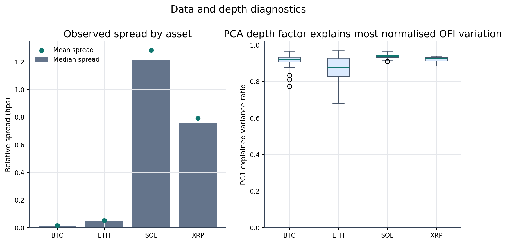
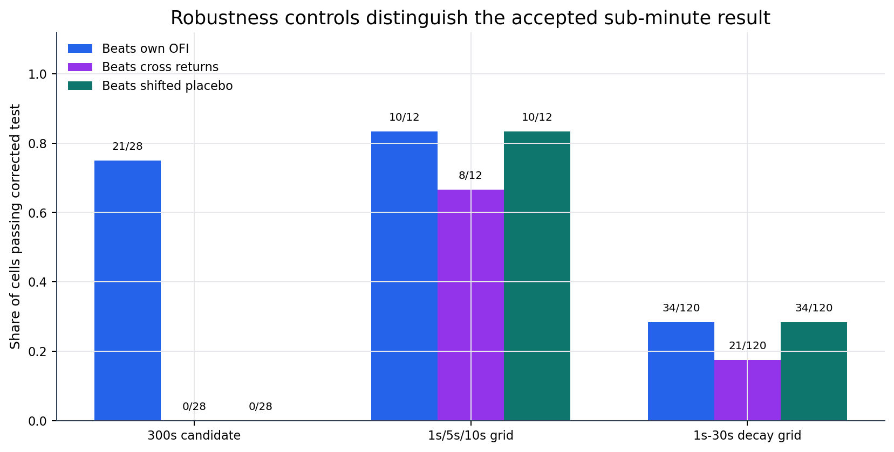

# Cross-Asset OFI in Crypto Markets

This summary is sourced from `report/methodology.md` and the generated artifacts
under `output/`.

## Short Verdict

The project finds robust sub-minute cross-asset OFI predictability in this OKX
crypto sample, strongest at 1s-5s bars. The result survives own-OFI,
cross-return-history and day-shifted placebo controls after conservative
multiple-comparison correction.

The result is not a finished trading claim. It is statistical microstructure
evidence and still needs a fresh holdout plus explicit spread, latency,
queue-position, fee and market-impact modelling before it can be framed as an
executable strategy.

## Visual Read

The main visual pattern is that cross-asset OFI sits above own-OFI and
return-history baselines at very short bar widths, then loses that clean
separation. The corrected pass-count visuals show the same conclusion from the
testing side: all four OFI schemes pass all three controls through 5s, only one
scheme passes at 6s, and no later bar width is treated as clean support.

## Data

- Venue: OKX.
- Assets: BTC-USDT, ETH-USDT, SOL-USDT, XRP-USDT.
- Sample: 2026-05-02 to 2026-06-26.
- Raw source: local OKX L2 snapshot/update `.data` files in `data/historical/`.
- Processed cache: reconstructed `.npz` files in `data/processed/`.
- Default modelling depth: top 10 book levels, with top 20 available for
  robustness checks.

Raw and processed data are not included in the GitHub repository. Reproduction
requires downloading the local OKX `.data` files first, placing them under
`data/historical/`, and then running the notebook's third code cell to verify
the local data inventory before reconstruction.

## What Was Tested

The project first replicated the paper-style 60-second CCZ setup. That
validated OFI construction and contemporaneous OFI-return links, but did not
produce a strong predictive result.

A broad grid then searched bars from 5s to 300s, four OFI definitions, multiple
lag sets and multiple horizons. The best slower candidate was a 300s CCZ-lag
family, but it failed the decisive robustness checks.

The final positive result came from the sub-minute design: a common-second
panel, 80% bar coverage rule, one current-bar OFI feature, tuned ridge, fixed
UTC 7-day train / 1-day test windows and a paired day-shifted placebo.

## Main Results

The 300s CCZ-lag candidate is exploratory only:

| Test | Passing cells after Bonferroni(672) |
|---|---:|
| Cross OFI beats own OFI | 21 / 28 |
| Cross OFI beats cross-return history | 0 / 28 |
| Real cross OFI beats shifted placebo | 0 / 28 |

The sub-minute 1s/5s/10s grid is the strongest result:

| Test | Passing cells after Bonferroni(684) |
|---|---:|
| Cross OFI beats own OFI | 10 / 12 |
| Cross OFI beats cross-return history | 8 / 12 |
| Real cross OFI beats shifted placebo | 10 / 12 |

The follow-up 1s-30s decay grid shows the effect is clean through 5s. At 6s
only one scheme passes all three controls, and later widths are mixed or
structurally hard to evaluate with the exact one-day placebo clock.

The robustness summary also explains why the 300s candidate is not the final
claim: it beats own OFI in many corrected cells but does not beat cross-return
history or the shifted placebo controls.

The temporal-stability check on the already-selected 1s-6s region uses the first
6 calendar weeks for training and the final 2 weeks for evaluation. All 24
frozen cells pass the three raw reference controls on that split, but this is
not a fresh holdout because the full sample had already been used to choose the
region.

## Conclusion

The defensible claim is:

> In this OKX BTC/ETH/SOL/XRP sample, cross-asset OFI contains statistically
> significant sub-minute predictive information beyond own OFI, cross-return
> history and a day-shifted cross-feature placebo. The effect is strongest at
> 1s-5s bars and should be frozen before testing on new data.

The full methodology is documented in `report/methodology.md`. The executable
reproduction path is documented in `notebooks/main.ipynb`.
